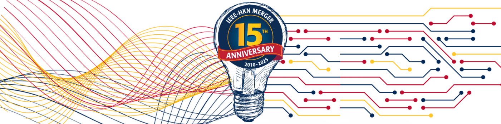

# HKN International Hackathon 2025 - Team 9 Spaghetti Overflow



Welcome to the Team 9 repository for the IEEE‑HKN International Hackathon 2025 — Spaghetti Overflow.

**This repo is the central place** where our team will develop work, gather resources, and prepare final submission artifacts.

## Event Overview

- **What:** IEEE‑HKN International Hackathon 2025 (virtual / distributed teams)
- **When:** 14 November 2025 – 23 November 2025
- **Launch Time:** 14 November 2025, 7:00 AM EST (12:00 AM UTC)
- **Submission Deadline:** 23 November 2025 @ 23:59 EST (04:59 UTC on 24 Nov)

## Tasks

This project targets the **IEEE-HKN Budget Hack 2025 – Smart Budget Scheduler for Chapter Growth** challenge:

- Design a **smart, user-friendly budgeting tool** for IEEE-HKN chapters.
- Help officers **plan yearly budgets**, manage real-time expenses and incomes, and forecast projections.
- Track **funding and administrative deadlines** in a dedicated, easy-to-scan view.
- Provide **exports and analytics** (CSV/PDF, charts, trends) to support reporting and decision-making.

## Repository layout

- `app/` – Smart Budget Scheduler application:
	- `app/client/` – Vite + React SPA with login/register, dashboard pages, analytics, security panel (2FA), and responsive styles.
	- `app/server/` – Express API with PostgreSQL, authentication, budgeting/analytics routes, exports, and seed scripts.
	- `app/docker-compose.yml`, `app/Makefile`, `app/.env.example` – Container stack and helper commands.
- `docs/` – Presentation and documentation artifacts for the final pitch.
- `resources/` – Hackathon brief, detailed requirements (`TASKS.md`), and other reference material.

## Team 9 — Spaghetti Overflow

All listed team members are members of the **Mu Nu Chapter** at **Politecnico di Torino** (Turin, Italy).

| Name | GitHub | LinkedIn | Email |
| ---- | ------ | -------- | ----- |
| Andrea Botticella | [](https://github.com/Botti01)       | [](https://www.linkedin.com/in/andrea-botticella-353169293/) | [](mailto:andrea.botticella@hknpolito.org) |
| Elia Innocenti | [](https://github.com/eliainnocenti) | [](https://www.linkedin.com/in/eliainnocenti/) | [](mailto:elia.innocenti@shknpolito.org) |
| Renato Mignone    | [](https://github.com/RenatoMignone) | [](https://www.linkedin.com/in/renato-mignone/)              | [](mailto:renato.mignone@hknpolito.org)    |
| Simone Romano | [](https://github.com/sroman0) | [](https://www.linkedin.com/in/simone-romano-383277307/) | [](mailto:simone.romano@hknpolito.org) |
| Eric Ruiz Giménez | [](https://github.com/thismanera) | [](https://www.linkedin.com/in/eric-ruiz-gimenez/) | [](mailto:eric.ruizgimenez@hknpolito.org) |
| Claudia Sanna     | [](https://github.com/sannaclaudia) | [](https://www.linkedin.com/in/claudiasanna1/)              | [](mailto:claudia.sanna@hknpolito.org)    |

## Project Overview

> For detailed setup, development, and deployment instructions (environment variables, Docker Compose commands, build/run steps, and troubleshooting), see [`app/README.md`](app/README.md) in the `app/` directory.

### Used Technologies

- **Frontend:** React 18, Vite, React Router, Recharts
- **Backend:** Node.js, Express 4, `pg`, Multer, PDFKit
- **Database:** PostgreSQL 16
- **Security:** JWT, bcrypt, TOTP (otplib), Helmet, rate limiting
- **Ops & Tooling:** Docker Compose, Makefile, Nginx

### Implemented Features

- **Budget intelligence:** Academic-year budgets with actual vs projected balances and archived-history browsing.
- **Transactions & receipts:** CRUD for incomes/expenses with categories, notes, planned/recurring entries, and file uploads.
- **Deadline radar:** Funding and admin deadlines with status tracking and localized timestamps.
- **Events & allocations:** Chapter events linked to specific budgets and transactions.
- **Exports & reporting:** One-click CSV/PDF budget packets suitable for advisors and university finance.
- **Auth + MFA:** Login/register, secure JWT cookie sessions, and optional TOTP-based 2FA from a dedicated security page.
- **OAuth integration:** Google OAuth login support with automatic user creation for seamless onboarding.
- **Role-based access control:** Three-tier permission system (admin, treasurer, member) with protected routes and admin panel.
- **Admin dashboard:** User management, category configuration, app settings customization, and system statistics.
- **Analytics dashboard:** Category breakdown charts, monthly trends, and deadline statistics at a glance.
- **Developer ergonomics:** Dockerized stack, seed scripts, and Make targets for quick spin-up and demo data.

## Running the Project

From the repository root:

```bash
cd app
cp .env.example .env # configure Postgres, JWT secret, allowed origins
make up              # build images and start postgres, server, client
make demo_seed       # optional: seed demo data
```

Default local endpoints:

- Client (React SPA): `http://localhost:5173`
- API (Express): `http://localhost:4000`
- PostgreSQL: `localhost:5432` (default user `postgres`, db `budgetdb`)

Demo login (after `make demo_seed`):

- **Username:** `demo`
- **Password:** `hackathon`

## API

For the full and up-to-date reference, see the route files under `app/server/src/routes/`. A snapshot of key endpoints:

**Auth & security**

- `POST /api/auth/register` – Create a new user (with timezone).
- `POST /api/auth/login` – Issue a JWT cookie session.
- `POST /api/auth/login/totp` – Complete login when MFA is enabled.
- `GET /api/auth/me` – Return the currently authenticated user.
- `POST /api/auth/logout` – Clear the auth cookie.
- `POST /api/auth/totp/setup` – Start TOTP enrollment (QR + secret).
- `POST /api/auth/totp/verify` – Confirm TOTP enrollment.
- `POST /api/auth/totp/disable` – Disable MFA with a fresh TOTP code.
- `GET /api/auth/oauth/google/status` – Check Google OAuth configuration status.
- `GET /api/auth/oauth/google` – Initiate Google OAuth login flow.
- `GET /api/auth/oauth/google/callback` – Handle OAuth callback and create/login user.
- `GET /api/auth/export-token` – Generate a short-lived export token.

**Admin (requires admin role)**

- `GET /api/admin/users` – List all users with their roles and OAuth status.
- `PATCH /api/admin/users/:id` – Update user role, display name, or timezone.
- `DELETE /api/admin/users/:id` – Delete a user (prevents deleting last admin or self).
- `GET /api/admin/categories` – List all transaction categories.
- `POST /api/admin/categories` – Create a new category (income, expense, or both).
- `PATCH /api/admin/categories/:id` – Update category name or type.
- `DELETE /api/admin/categories/:id` – Delete a category.
- `GET /api/admin/settings` – Get application settings (theme, logo, colors, etc.).
- `POST /api/admin/settings` – Update application settings.
- `GET /api/admin/stats` – Get system statistics (user count, budgets, transactions, role distribution).

**Budgets, transactions, events, deadlines**

- `GET /api/budgets` – List budgets with current balances and metadata.
- `GET /api/budgets/archived` – View archived academic-year budgets.
- `GET /api/transactions` – List transactions; `POST /api/transactions` – Create a transaction.
- `POST /api/transactions/:id/receipt` – Upload or update a receipt file.
- `GET /api/events` / `POST /api/events` – Manage chapter events linked to budgets.
- `GET /api/deadlines` / `POST /api/deadlines` – Manage funding/administrative deadlines.

**Analytics & exports**

- `GET /api/analytics/overview` – Category breakdown, monthly trends, and deadline stats.
- `GET /api/exports/budget/:id/csv` – Export a budget as CSV.
- `GET /api/exports/budget/:id/pdf` – Export a budget packet as PDF.

## Database Structure

The backend uses PostgreSQL. A simplified logical schema:

**`users`**
- `id` – `serial` – **PK**
- `username` – `text` – unique
- `password_hash` – `text`
- `display_name` – `text`
- `timezone` – `text` – default 'UTC'
- `role` – `text` – default 'member' (admin/treasurer/member)
- `oauth_provider` – `text` – nullable (e.g., 'google')
- `oauth_id` – `text` – nullable (external OAuth user ID)
- `totp_secret` – `text` – nullable (for MFA)
- `totp_enabled` – `boolean` – default false
- `totp_verified_at` – `bigint` – nullable
- `created_at` – `bigint`

**`budgets`**
- `id` – `serial` – **PK**
- `name` – `text`
- `academic_year_start` – `bigint`
- `academic_year_end` – `bigint`
- `allocated_amount` – `integer` – default 0
- `owner_id` – `integer` – **FK → users(id)**
- `created_at` – `bigint`

**`events`**
- `id` – `serial` – **PK**
- `budget_id` – `integer` – **FK → budgets(id)**
- `name` – `text`
- `allocated_amount` – `integer` – default 0
- `start_ts` – `bigint` – nullable
- `end_ts` – `bigint` – nullable
- `notes` – `text` – nullable

**`transactions`**
- `id` – `serial` – **PK**
- `budget_id` – `integer` – **FK → budgets(id)**
- `event_id` – `integer` – nullable **FK → events(id)**
- `user_id` – `integer` – nullable **FK → users(id)**
- `type` – `text` – income/expense
- `status` – `text` – actual/planned/recurring (default 'actual')
- `amount_cents` – `integer`
- `category` – `text`
- `notes` – `text` – nullable
- `timestamp` – `bigint`
- `recurrence_rule` – `text` – nullable
- `receipt_path` – `text` – nullable
- `created_at` – `bigint`
- `updated_at` – `bigint`

**`deadlines`**
- `id` – `serial` – **PK**
- `budget_id` – `integer` – **FK → budgets(id)**
- `title` – `text`
- `description` – `text` – nullable
- `due_timestamp` – `bigint`
- `category` – `text` – nullable
- `status` – `text` – open/submitted/won/lost (default 'open')
- `link` – `text` – nullable
- `created_at` – `bigint`

**`attachments`**
- `id` – `serial` – **PK**
- `transaction_id` – `integer` – **FK → transactions(id)**
- `file_name` – `text`
- `mime_type` – `text`
- `file_path` – `text`
- `uploaded_at` – `bigint`

**`budget_members`**
- `id` – `serial` – **PK**
- `budget_id` – `integer` – **FK → budgets(id)**
- `user_id` – `integer` – **FK → users(id)**
- `role` – `text` – editor/viewer (default 'viewer')
- `added_at` – `bigint`
- **Unique constraint:** (budget_id, user_id)

**`categories`**
- `id` – `serial` – **PK**
- `name` – `text` – unique
- `type` – `text` – income/expense/both (default 'both')
- `created_at` – `bigint`

**`app_settings`**
- `key` – `text` – **PK**
- `value` – `text`
- `updated_at` – `bigint`
